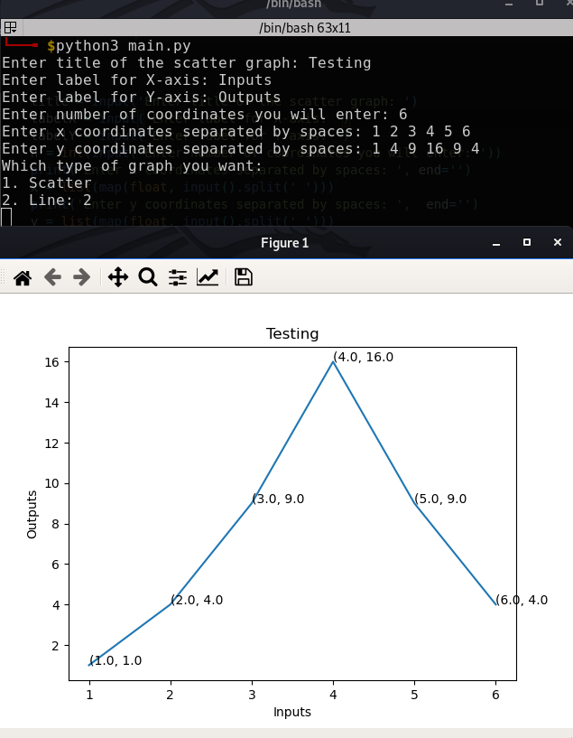
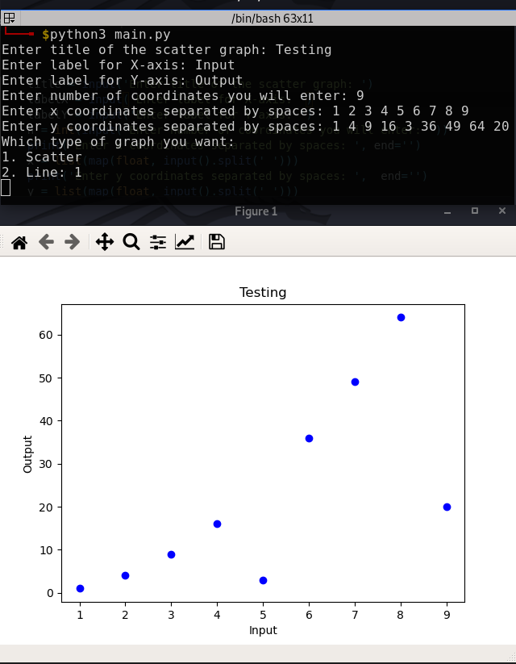
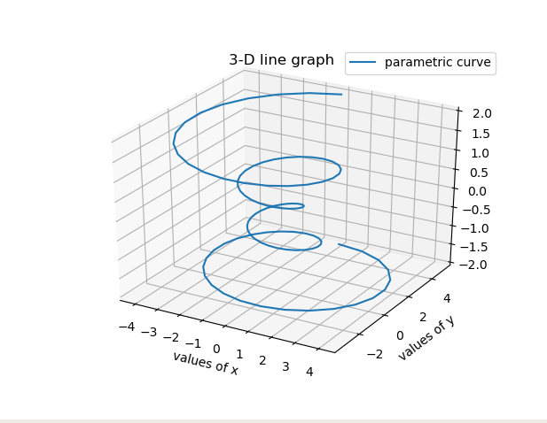
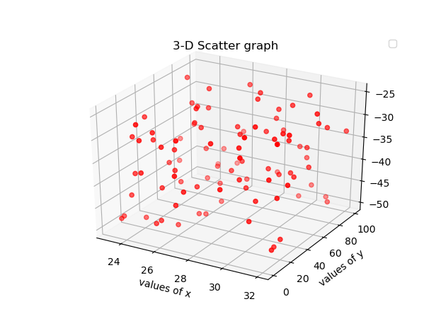
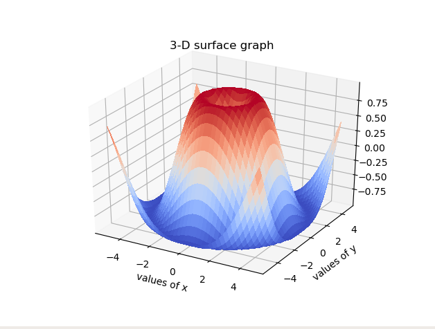

## Plotting graph

Used `pyplot` from `matplotlib` library. 

### Installation
`pip install matplotlib`

### Usage
`python3 main.py`

One can try among different plots

### 2-D plots

1. Line
   

2. Scatter
 

### 3-D plots

1. Line
   

2. Scatter
   

3. Surface
   

